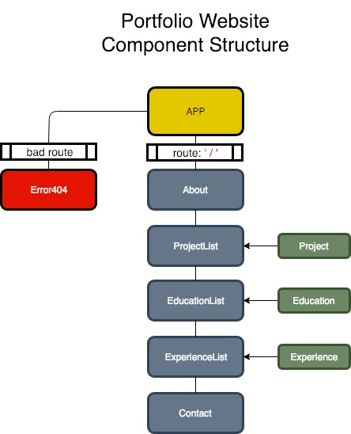

# Portfolio Site

View published site [here](https://jaredreando.github.io/jreando-portfolio-site/)

#### A web site showcasing my developer portfolio built with React.

#### By Jared Reando
###### February 14, 2019

## Description

This is my portfolio web site. 

It's where I'll post things about myself, my development work, past projects, education, and work experience. 

It's meant to be a one-stop place to snoop around on who I am, what I'm about, and what kind of work I've done and want to do in the future.

Happy snooping!

## Project Structure



## Setup/Installation Requirements
#### 1. Clone the project to your local drive:
```
$ git clone https://github.com/jaredreando/jreando-portfolio-site
```
#### 2. Install project dependencies:
```
$ npm install
```
#### 3. Build and start local server hosting:
```
$ npm run start
```
#### 4. View the project in your web broswer: http://localhost:8080/ 

## Known Bugs

No known bugs.

## Support and contact details

jaredreando@gmail.com

## Technologies Used
- Javascript
- React
- HTML/CSS
- Webpack

### License

This software is licensed under the MIT license.
